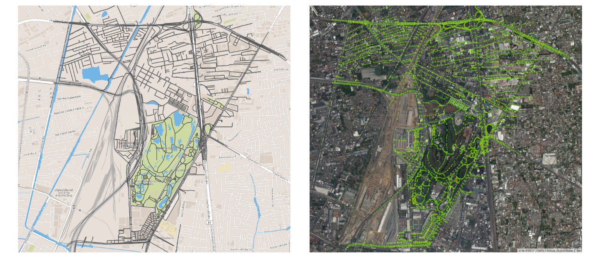
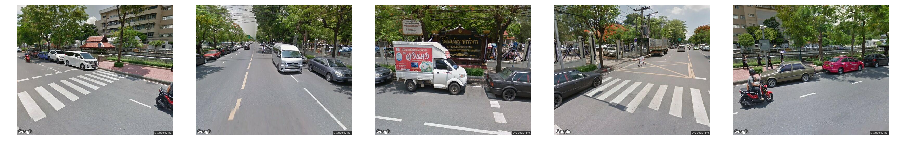

# Google Street View Loader Demo

## Prerequisites
```
pip3 install -r requirements.txt
```

## How it works

## Step 1: Convert geojson polygon to points/coordinates

<p align="center">

</p>


### Step 2: Extract coordinates along roads/streets cooresponding to the subdistrict

<p align="center">

</p>

### Step 3: Send the coordinates to the street view api to retrieve static images

<p align="center">

</p>
